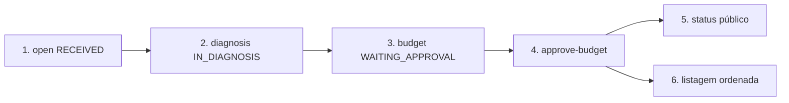

# Fase 2 — Endpoints obrigatórios (passo a passo)

Guia curto dos endpoints pedidos no enunciado da Fase 2. Base URL local: `http://localhost:3000`.

> **Não funciona:** `POST /service-orders/open` seguido direto de `approve-budget`.
>
> A OS abre em **`RECEIVED`**, **sem orçamento**. Aprovar exige status **`WAITING_APPROVAL`** e orçamento já gerado.
>
> É **obrigatório** chamar o diagnóstico (`PATCH .../diagnosis`) e depois gerar o orçamento (`POST .../budget`) **antes** de aprovar.



---

## 0. Login (JWT)

Necessário para os endpoints autenticados (open, diagnosis, budget, listagem).

**URL:** `POST http://localhost:3000/auth/login`

```json
{
  "email": "admin@local.dev",
  "password": "admin123"
}
```

Use o token na header: `Authorization: Bearer <token>`.

---

## Pré-requisito: catálogo e peça

O `open` **não cria** serviço nem produto — só vincula. Antes, cadastre (JWT):

- `POST /product` + `POST /product-batch` (estoque)
- `POST /services` (guarde o `id` como `catalogServiceId`)

Detalhes em [`api-fluxo-abrir-os-endpoint.md`](api-fluxo-abrir-os-endpoint.md).

---

## 1. Abrir OS completa

**Enunciado:** receber cliente, veículo, serviços e peças → identificação única da OS.

**URL:** `POST http://localhost:3000/service-orders/open` · **JWT**

```json
{
  "client": {
    "name": "João Silva",
    "document": "12345678909",
    "email": "joao@email.com"
  },
  "vehicle": {
    "plate": "NBK-6334",
    "model": "HR-V",
    "brand": "Honda",
    "year": 2024
  },
  "requestedServicesDescription": "Barulho na suspensão",
  "services": [
    { "catalogServiceId": "SUBSTITUA-PELO-ID-DO-POST-SERVICES", "quantity": 1 }
  ],
  "parts": [{ "productCode": "OLEO01", "quantity": 1 }]
}
```

Resposta: OS com `id` (`{OS_ID}`) e status **`RECEIVED`**.

---

## 2. Diagnóstico (obrigatório antes do orçamento)

Sem este passo, `POST .../budget` falha com regra de negócio.

**URL:** `PATCH http://localhost:3000/service-orders/{OS_ID}/diagnosis` · **JWT**

```json
{
  "diagnosis": "Amortecedores com folga; recomendada troca."
}
```

Status após esta chamada: **`IN_DIAGNOSIS`**.

---

## 3. Gerar orçamento

Coloca a OS em **`WAITING_APPROVAL`**. Na primeira geração há notificação simulada (log `[orçamento enviado]`, sem e-mail SMTP).

**URL:** `POST http://localhost:3000/service-orders/{OS_ID}/budget` · **JWT** · sem body.

---

## 4. Aprovar orçamento (notificação externa)

**Enunciado:** endpoint para aprovação/recusa externa do orçamento.

**URL:** `POST http://localhost:3000/public/service-orders/{OS_ID}/approve-budget?document=12345678909&plate=NBK-6334`

Sem JWT · sem body. Use o mesmo `document` e `plate` da OS.

> Só funciona depois dos passos 2 e 3. Chamar logo após o `open` → erro (status ainda `RECEIVED` / sem budget).

Recusa (opcional): `POST .../reject-budget?document=...&plate=...`

---

## 5. Consultar status da OS

**Enunciado:** informar motivo/situação atual da OS.

**URL:** `GET http://localhost:3000/public/service-orders/status?document=12345678909`

Sem JWT · sem body. Retorna as OS do documento com o status atual (ex.: `WAITING_APPROVAL`, `IN_EXECUTION`, …).

---

## 6. Listagem ordenada

**Enunciado:** ordenar por status (Em Execução > Aguardando Aprovação > Diagnóstico > Recebida), mais antigas primeiro; excluir finalizadas e entregues da listagem.

**URL:** `GET http://localhost:3000/service-orders` · **JWT** · sem body.

A listagem **não inclui** `FINISHED`, `DELIVERED` nem `CANCELLED` (exclusão lógica na consulta).

---

## Ordem correta (resumo)

| # | Método e path | Status após |
|---|----------------|-------------|
| 1 | `POST /service-orders/open` | `RECEIVED` |
| 2 | `PATCH /service-orders/{id}/diagnosis` | `IN_DIAGNOSIS` |
| 3 | `POST /service-orders/{id}/budget` | `WAITING_APPROVAL` |
| 4 | `POST /public/service-orders/{id}/approve-budget` | orçamento aprovado / execução |
| 5 | `GET /public/service-orders/status` | — (consulta) |
| 6 | `GET /service-orders` | — (listagem) |

Swagger: `http://localhost:3000/api`.
