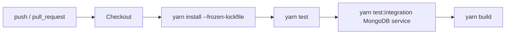
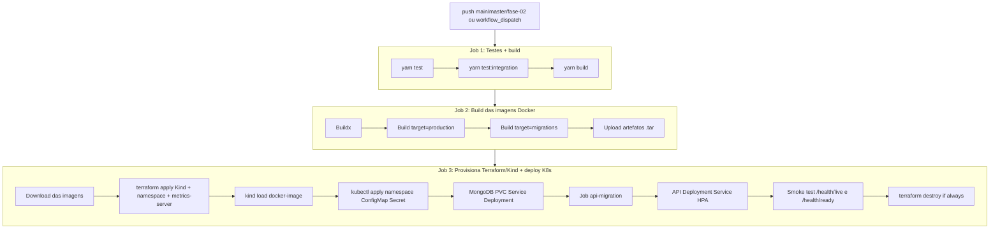

# Diagrama de Fluxo CI/CD

Baseado nos workflows reais do repositório:
[`.github/workflows/ci.yml`](../../.github/workflows/ci.yml) e
[`.github/workflows/cd.yml`](../../.github/workflows/cd.yml).

## CI — Integração Contínua (`ci.yml`)

Dispara em `push` para `main`/`master` e em `pull_request`. Sobe um serviço
MongoDB e roda testes + build.

## CD — Entrega/Deploy Contínuo (`cd.yml`)

Dispara em `push` para `main`/`master`/`fase-02` (ou `workflow_dispatch`). Três
jobs encadeados: testes, build das imagens e provisionamento + deploy.

> Após o smoke test, o `cd.yml` roda `terraform destroy` com `if: always()`
> (sucesso ou falha). O cluster Kind do CD vive só no runner efêmero do job;
> demos ou inspeção prolongada usam Kind local (`infra/`).

## Resumo

| Etapa | Onde | O que faz |
|-------|------|-----------|
| **CI** | `ci.yml` (job `test`) | Build, testes unitários e de integração a cada PR/push |
| **CD — Build** | `cd.yml` (job `build-images`) | Gera imagens Docker `production` e `migrations` |
| **CD — Deploy** | `cd.yml` (job `deploy`) | Cria cluster Kind, aplica migrations, faz deploy da API + HPA, valida com smoke test e destrói o cluster |
