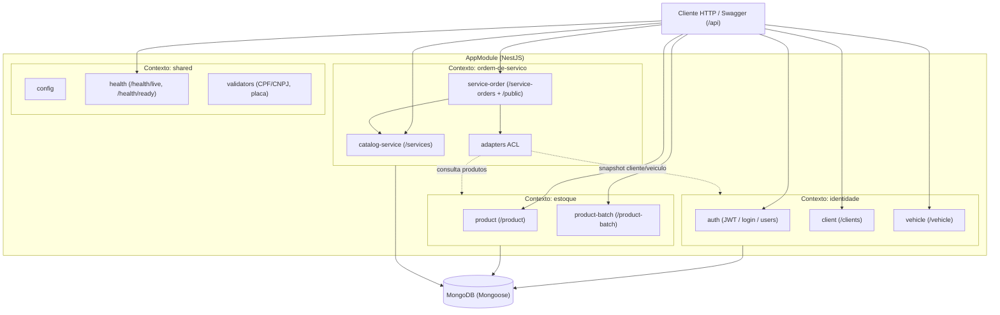
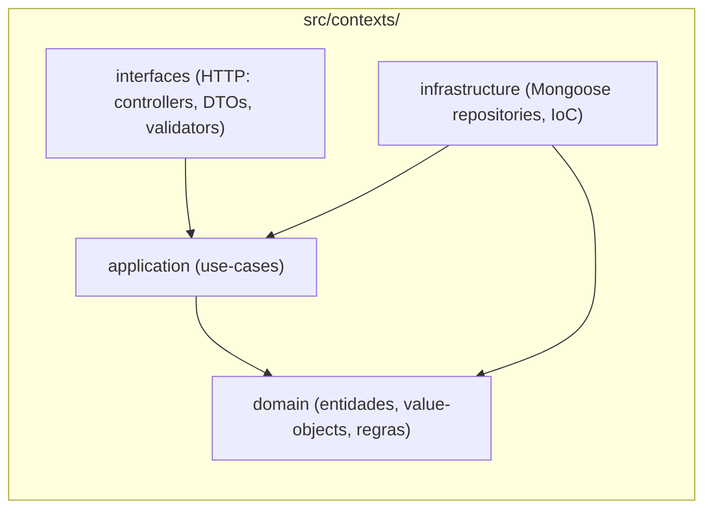

# Diagrama de Componentes — Monólito Modular (NestJS)

A aplicação é um **monólito modular** organizado por *bounded contexts* de DDD.
Cada contexto vive em `src/contexts/<contexto>` e é dividido nas camadas
`domain`, `application`, `infrastructure` e `interfaces` (Clean Architecture).

Os contextos são registrados como módulos NestJS em
`src/contexts/shared/infrastructure/ioc/*` e importados por `src/app.module.ts`.

O contexto `ordem-de-servico` acessa `identidade` e `estoque` apenas pela
camada anticorrupção em `src/contexts/ordem-de-servico/infrastructure/adapters/`
(`IdentidadeClientAdapter`, `IdentidadeVehicleAdapter`, `EstoqueProductAdapter`).

## Contextos e submódulos

| Contexto | Submódulos (rotas HTTP) | Responsabilidade |
|----------|-------------------------|------------------|
| `identidade` | `auth`, `client`, `vehicle` | Autenticação/JWT, clientes e veículos |
| `estoque` | `product`, `product-batch` | Produtos e lotes/estoque |
| `ordem-de-servico` | `catalog-service`, `service-order` | Catálogo de serviços e Ordens de Serviço |
| `shared` | `config`, `health`, `validators` | Configuração, health checks e validadores comuns |

## Visão de componentes

## Camadas por contexto (Clean Architecture)

> **Nota:** as regras de dependência apontam sempre para o `domain`. As camadas
> `interfaces` e `infrastructure` dependem de `application`/`domain`, nunca o
> contrário.
