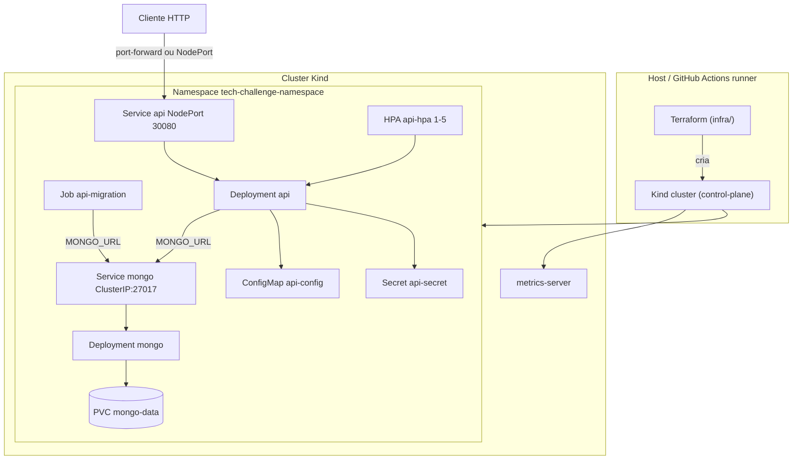

# Diagrama de Infraestrutura — Kind + Kubernetes

Desenho de solução do que o repositório **realmente provisiona**: cluster
**Kind** via Terraform ([`infra/`](../../infra)) e workloads nos manifestos
[`k8s/`](../../k8s). Usado localmente e no pipeline de CD.

**Runtime no cluster:** MongoDB, Job de migrations e API rodam **somente**
como pods/workloads no namespace `tech-challenge-namespace`. Não há Compose,
Mongo no host nem API fora do Kind nesta fase. Docker no host apenas executa
os nós do Kind e carrega imagens.

## Visão da solução

## O que o Terraform cria (`infra/`)

| Recurso | Arquivo / recurso | Papel |
|---------|-------------------|--------|
| Cluster Kind | `kind_cluster.this` | Control-plane com mapeamento de portas 80/443 |
| Namespace | `kubernetes_namespace.app` | Namespace da aplicação |
| metrics-server | `kubectl_manifest.metrics_server` | Métricas para o HPA |

MongoDB, API, Job e HPA **não** são criados pelo Terraform — só via
`kubectl apply` dos YAMLs em `k8s/`. Mesmo assim, **todos rodam no Kubernetes**
(não há banco ou API fora do cluster nesta fase).

## Workloads (`k8s/`)

| Manifesto | Kind | Nome |
|-----------|------|------|
| `namespace.yaml` | Namespace | `tech-challenge-namespace` |
| `configmap.yaml` | ConfigMap | `api-config` |
| `secret.yaml` | Secret | `api-secret` |
| `mongo-pvc.yaml` | PersistentVolumeClaim | `mongo-data` |
| `mongo-deployment.yaml` | Deployment | `mongo` |
| `mongo-service.yaml` | Service (ClusterIP) | `mongo` |
| `migration-job.yaml` | Job | `api-migration` |
| `api-deployment.yaml` | Deployment | `api` (probes `/health/live`, `/health/ready`) |
| `api-service.yaml` | Service (NodePort 30080) | `api` |
| `hpa.yaml` | HorizontalPodAutoscaler | `api-hpa` (CPU 70% / memória 80%, 1–5 réplicas) |

## Imagens Docker

| Target no `Dockerfile` | Tag usada no cluster |
|------------------------|----------------------|
| `production` | `tech-challenge-api:latest` |
| `migrations` | `tech-challenge-api:migrations` |
